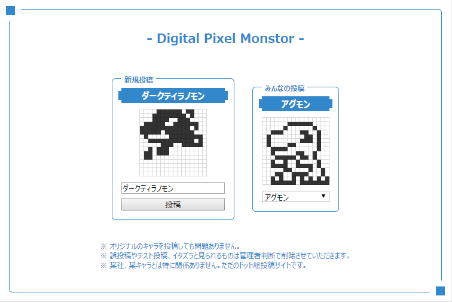

# Digital Dot Monster

GoとRiotで作ったデジモンのドット絵を打つだけのサイトです。

http://digimon.laineus.com/

# Setup

- MySQLにDBを作成し`sql/db.sql`を実行
- `api/.env.sample`を元に`api/.env`を作成
- `api/main.go`を実行
- ドキュメントルートを`htdocs`に設定
- `/api/`で始まるリクエストを`api/main.go`が動くポートへ流す
